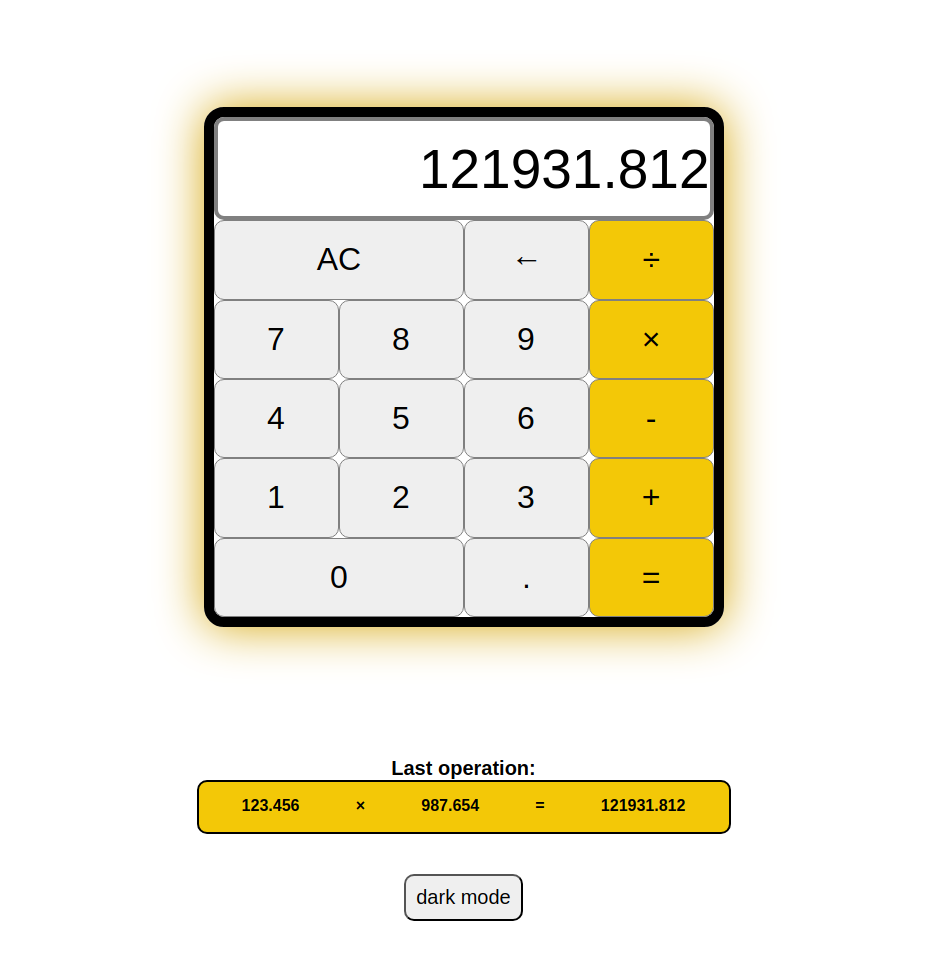
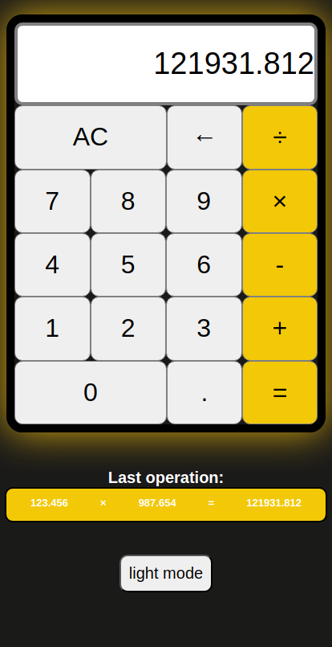

# Odin Project #5: Calculator

The goal of this Odin Project assignment was to create a calculator with an interface.

I started and finished this project in July 2022.

## Assignment

[The Odin Project - Foundations - #5 Calculator](https://www.theodinproject.com/lessons/foundations-calculator)

## Technology

- HTML
- CSS
- Vanilla JavaScript

## Key Concepts

- DOM manipulation: querySelectorAll, getElementById and addEventListener
- JavaScript functions
- Chrome DevTools

## Features

- Display the most recent operation
- Display an error for division by zero
- Light / dark mode

## Links

[Live Demo](https://bn7631-odin-calculator.pages.dev)

## Screenshots

### Desktop



### Mobile



## Deployment

```bash
  git clone https://github.com/BrightNeon7631/odin-calculator.git
```
